# 

### One remote. One app. Every screen.

**TvMoTo** brings your anime, movies, and TV shows together in a single app built
for the way you actually watch — sprawled on the couch, remote in hand, big screen in
front of you.

No more juggling five different apps to find one thing to watch. No more hunting for
your remote's tiny keyboard. TvMoTo is designed **remote-first**, from the ground up,
for Android TV — and it still works great on your phone, with a mouse, or with touch.

  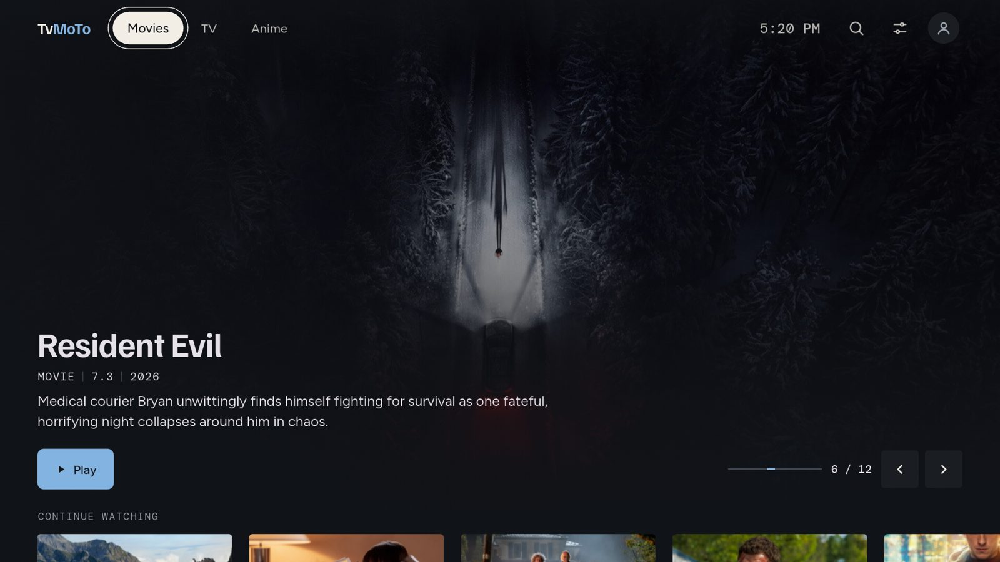

---

## ⚠️ Before you install — current known rough edges

TvMoTo is actively being built, and two parts of the app aren't finished yet.
Nothing here affects watching anything — it's just honesty about what's done and
what isn't:

- **The Profile page is currently broken.** You may see it in the app, but it
  doesn't work properly yet.
- **The Settings page doesn't look finished.** The screens are there, but many of
  the options behind them still need to be connected up behind the scenes, so some
  parts look and feel incomplete. (A few sections are marked **SOON**.)

Neither of these is the main priority right now. Watching, browsing, and searching
come first — these two will get their turn.

---

## Why TvMoTo?

**🎬 Anime, movies, and TV shows — all in one place**
Stop switching apps depending on what you feel like watching. TvMoTo puts
everything in one home screen, one search bar, one "Continue Watching" list.

**📺 Built for your TV remote, not your keyboard**
Every screen, button, and menu works with just a remote — up, down, left, right,
select. No mouse needed. (It also works on phones, tablets, and computers.)

**🔄 If one source goes down, TvMoTo tries another**
Streaming links break — that's just how free streaming works. Instead of showing
an error and giving up, TvMoTo quietly tries other sources until one plays.

**⏭️ Skip the intro. Get to the story.**
A one-tap "Skip" button for openings and endings — for anime, shows, and movies.

**▶️ Pick up right where you left off**
"Continue Watching" remembers every episode and movie you've started, and shows
how much time is left.

**🌗 Nine looks, light or dark**
Six dark themes for movie nights and three light ones for daytime or desktop.
Pick one yourself, let it switch automatically with sunrise and sunset, or let
it surprise you with a new one each time you open the app.

**📚 Always up to date**
Anime info and artwork come from AniList, one of the largest community-run anime
databases. Movie and TV info comes from TMDB (The Movie Database). That means
fresh posters, accurate titles, and cast lists that stay current.

**🆓 Free. No account. No paywall.**
No sign-up, no subscription, no locked features. Supporting development is
completely optional — the app stays free either way.

---

## See it in action

### On your TV

  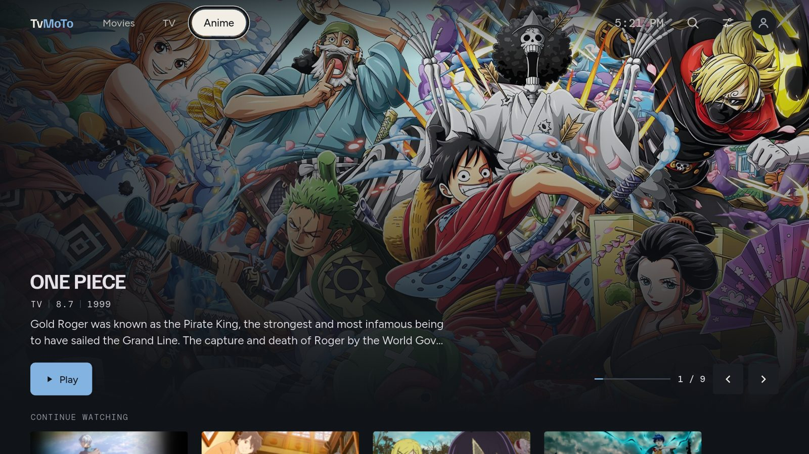
  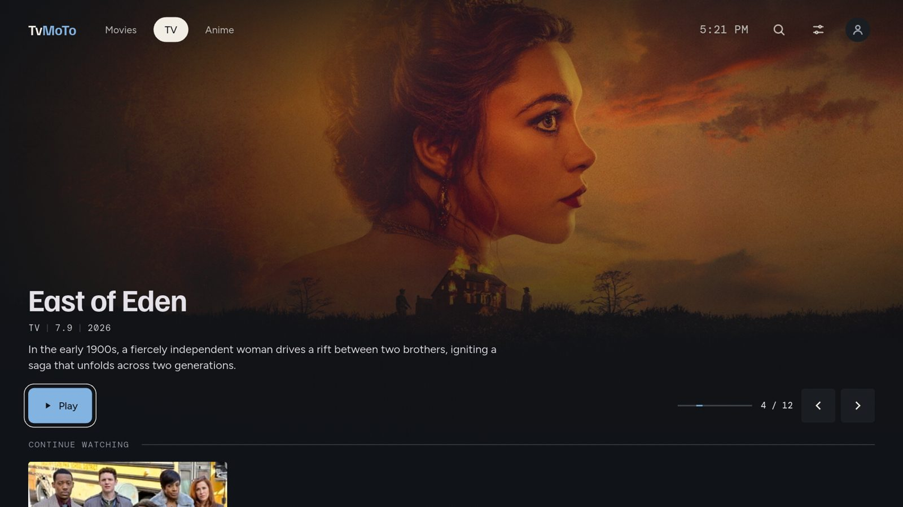

  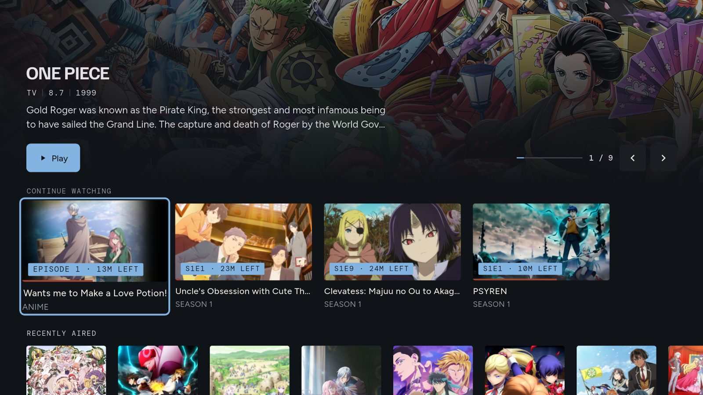
  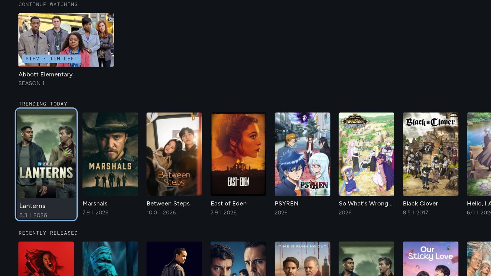

  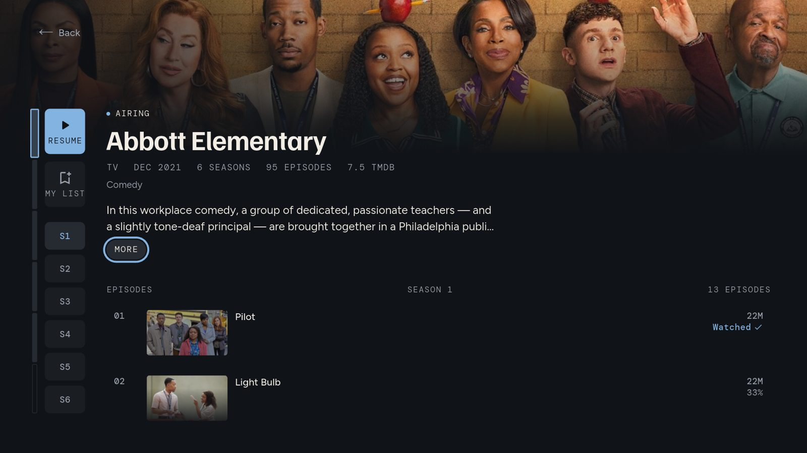
  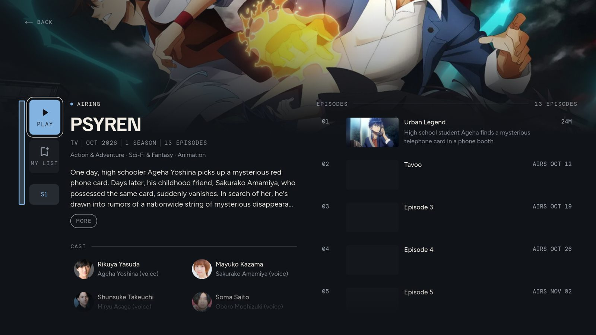

  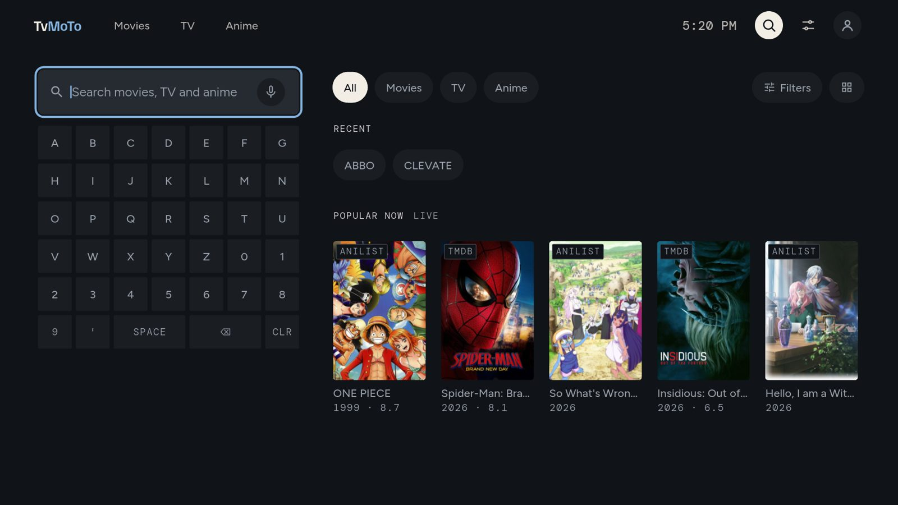

### Light or dark — your choice

  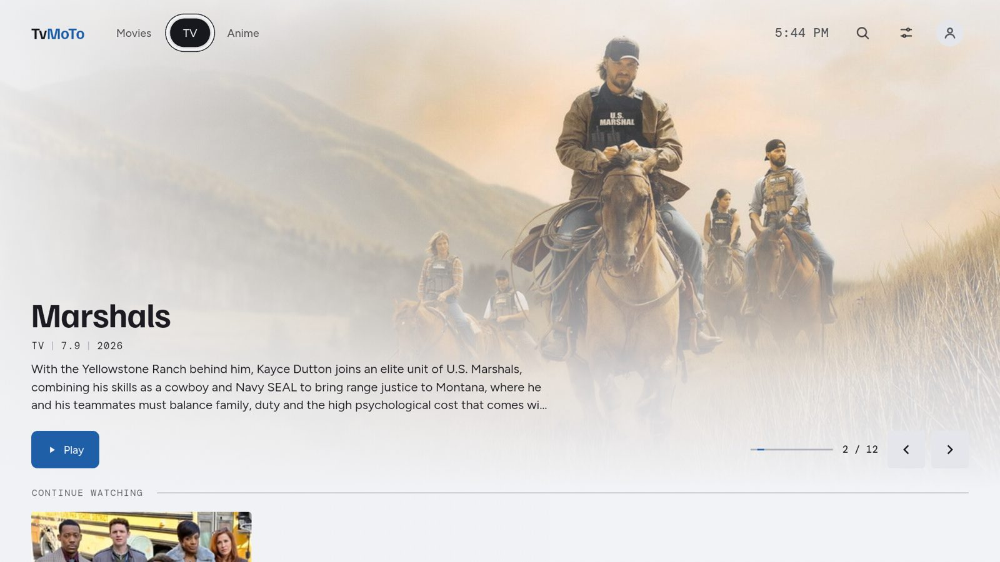
  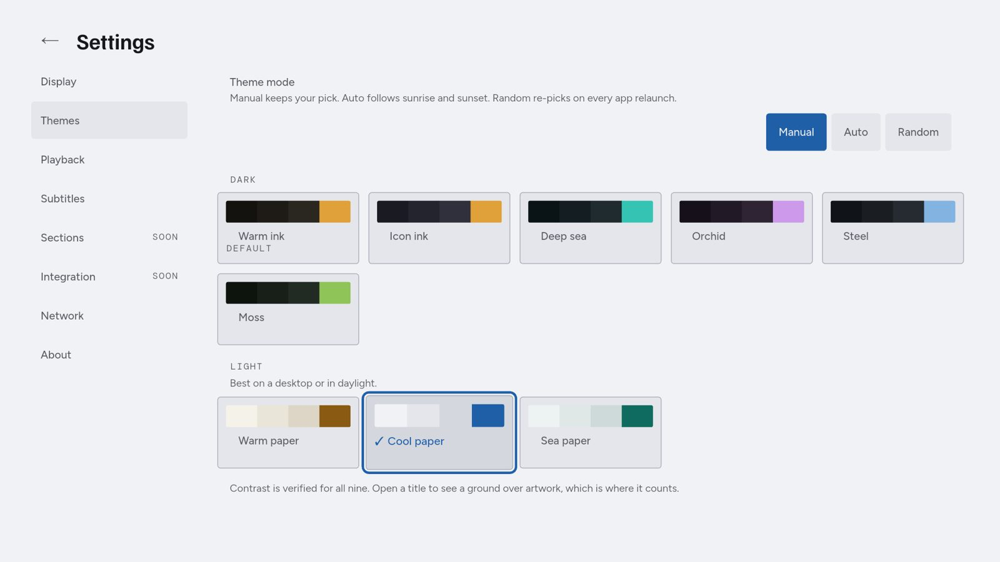

### On your phone

  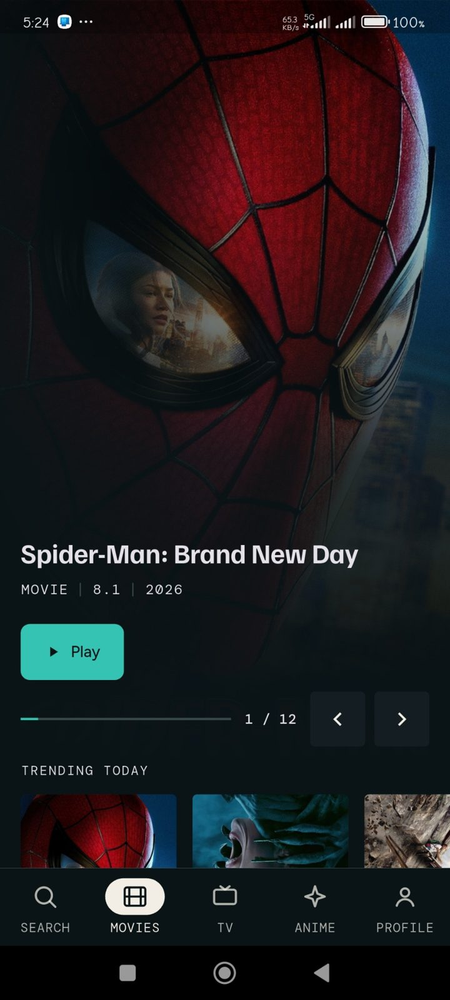
  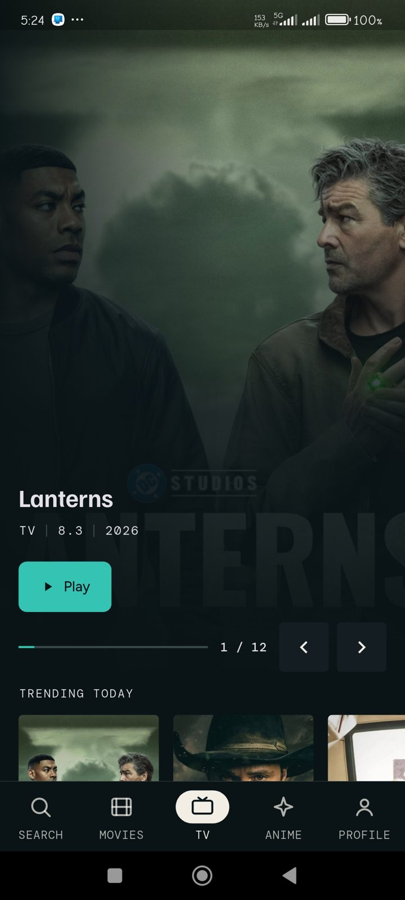
  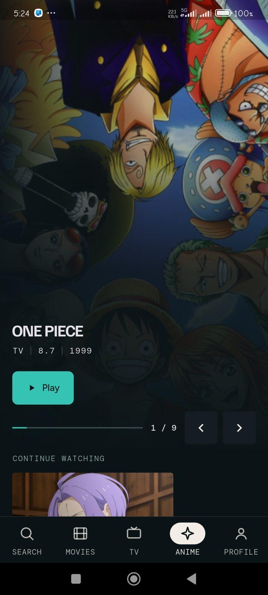
  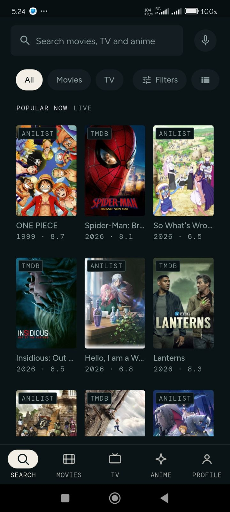

  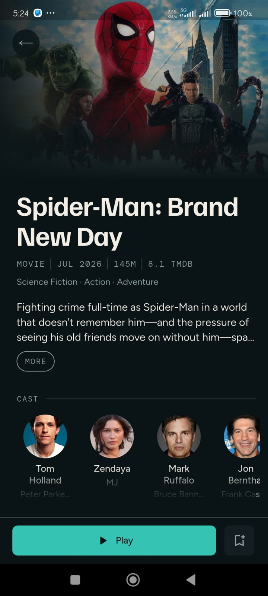
  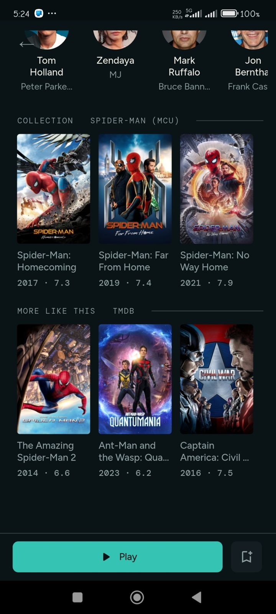
  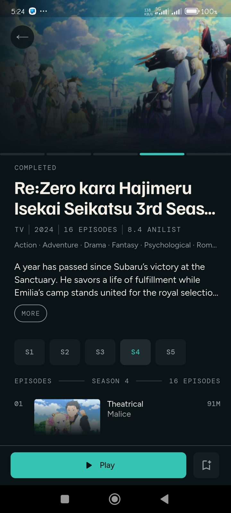

---

## Where to get it

TvMoTo runs best on **Android TV**, **Android phones**, and **Windows**. Support
for macOS, Linux, and web is in progress.

**Download the latest release:**
👉 **[github.com/TvMoTo/TvMoTo/releases](https://github.com/TvMoTo/TvMoTo/releases)**

*(TvMoTo is under active development. New features and fixes ship regularly —
check the Releases page for the newest version.)*

---

## Support the project

TvMoTo is a free, independent, passion-built project. If you enjoy it and want to
help keep it going, you can leave a small tip — completely optional, and never
required for any feature.

☕ **[Support TvMoTo on Ko-fi](https://ko-fi.com/tvmoto)**

If the link doesn't open anything (some ad-blockers quietly block payment pages),
type it in directly: `ko-fi.com/tvmoto`

Every bit of support is appreciated — thank you 🙏

---

## A quick note on how TvMoTo works

TvMoTo is a **catalog and player**, not a video host. Show and movie *information*
(titles, artwork, descriptions) comes from AniList and TMDB; *playback* comes from
independent streaming sources on the web. TvMoTo doesn't host, store, or upload
any video files itself.

---

Made with ❤️ for people who just want to watch something, fast.

