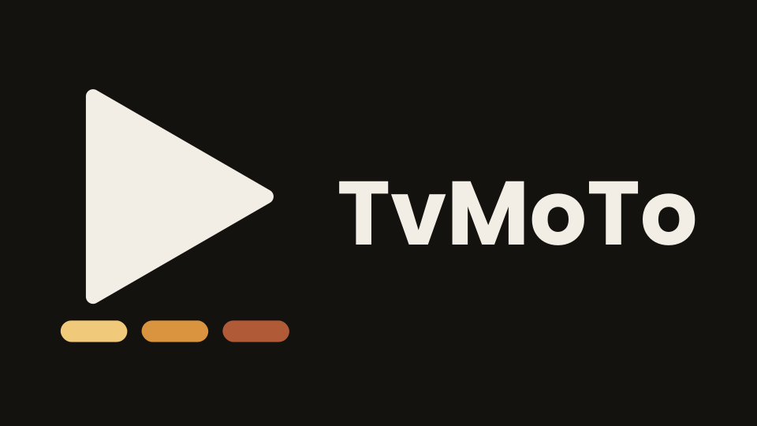

# 

### One remote. One app. Every screen.

**TvMoTo** brings your anime, movies, and TV shows together in a single app built
for the way you actually watch — sprawled on the couch, remote in hand, big screen in
front of you.

No more juggling five different apps to find one thing to watch. No more hunting for
your remote's tiny keyboard. TvMoTo is designed **remote-first**, from the ground up,
for Android TV — and it still works great with a mouse or a touchscreen if that's
what you've got.

  

---

## Why TvMoTo?

**🎬 Anime, movies, and TV shows — all in one place**
Stop switching apps depending on what you feel like watching. TvMoTo pulls
everything into one home screen, one search bar, one "Continue Watching" list.

**📺 Built for your TV remote, not your keyboard**
Every screen, every button, every menu is designed to be driven entirely with a
D-pad remote — up, down, left, right, select. No awkward on-screen typing, no
mouse required. (It also works fine with a mouse or touch, if you're on a phone,
tablet, or desktop.)

**🔄 If one source goes down, TvMoTo tries another**
Streaming links break — that's just how free streaming works. TvMoTo doesn't
just show you an error and give up. It automatically tries other sources in the
background until it finds one that plays, so you spend less time troubleshooting
and more time watching.

**⏭️ Skip the intro. Skip the recap. Get to the story.**
TvMoTo detects opening and ending sequences and gives you a one-tap "Skip" button,
for anime and for regular shows and movies alike.

**▶️ Pick up right where you left off**
Your "Continue Watching" row remembers every episode and movie you've started,
so you never lose your place.

**🌗 A look that fits your mood**
Choose from a set of dark, cinema-friendly themes — pick one yourself, let it
automatically shift with sunrise and sunset, or let it surprise you with a
different look every time you open the app.

**📚 Always up to date**
Anime info and artwork come from AniList, one of the largest community-maintained
anime databases around. Movie and TV info comes from TMDB (The Movie Database).
Both mean fresh posters, accurate titles, and detail pages that stay current.

**🆓 Free. No account. No paywall.**
TvMoTo doesn't ask you to sign up, doesn't lock features behind a subscription,
and never will. If you'd like to support development, that's entirely optional
(more on that below) — but the app itself stays free either way.

---

## Where to get it

TvMoTo currently runs best on **Android TV** and **Windows**, with support for
Android phones/tablets, macOS, Linux, and web also in progress.

**Download the latest release:**
👉 **[github.com/TvMoTo/TvMoTo/releases](https://github.com/TvMoTo/TvMoTo/releases)**

*(TvMoTo is under active development. New features and fixes ship regularly —
check the Releases page for the newest version.)*

---

## Support the project

TvMoTo is a free, independent, passion-built project. If you enjoy using it and
want to help keep it going, you can leave a small tip — completely optional, and
never required to use any feature of the app.

☕ **[Support TvMoTo on Ko-fi](https://ko-fi.com/tvmoto)**

If the button above doesn't open anything (some ad-blockers and network-level
filters silently block payment pages), you can also just visit the link directly:
`ko-fi.com/tvmoto`

Every bit of support is genuinely appreciated — thank you 🙏

---

## A quick note on how TvMoTo works

TvMoTo is a **catalog and player**, not a content host. Show and movie
*information* (titles, artwork, descriptions) comes from AniList and TMDB;
*playback* is handled by independent streaming sources found elsewhere on the
web. TvMoTo doesn't host, store, or upload any video files itself.

---

Made with ❤️ for people who just want to watch something, fast.

